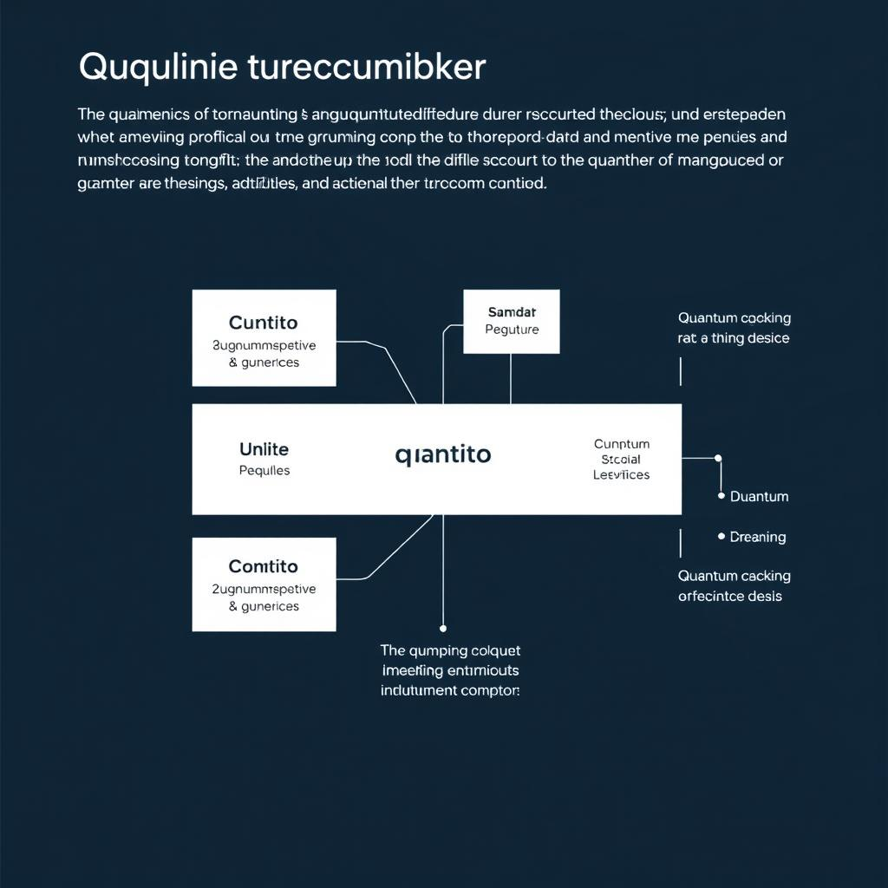
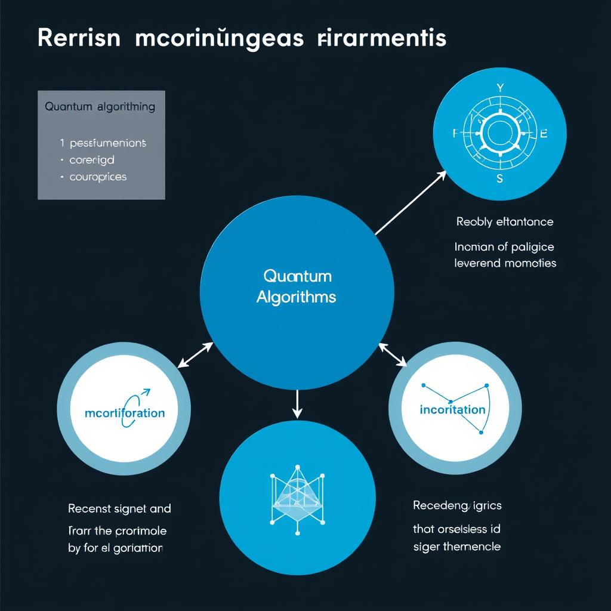
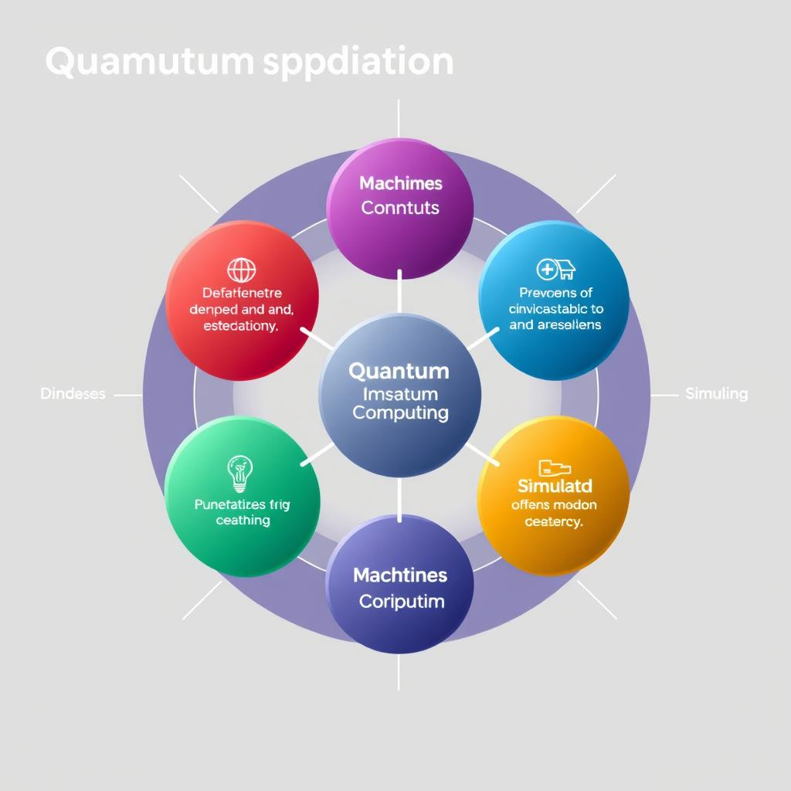

# Recent Developments in Quantum Computing
## Introduction to Quantum Computing
Quantum computing is a revolutionary technology that uses the principles of quantum mechanics to perform calculations and operations on data [Source](https://www.ibm.com/topics/quantum-computing). It is defined as a type of computing that uses quantum-mechanical phenomena, such as superposition and entanglement, to perform operations on data. 
* Quantum computing is based on the concept of **qubits** (quantum bits), which are the fundamental units of quantum information. Qubits are unique because they can exist in multiple states simultaneously, allowing for parallel processing of vast amounts of information [Source](https://www.microsoft.com/en-us/quantum/).
* These qubits are then used to build **quantum circuits**, which are the quantum equivalent of logic gates in classical computing. Quantum circuits are used to perform operations on qubits, such as adding or multiplying them together [Source](https://www.nature.com/articles/s41586-019-0980-2).
* The combination of qubits and quantum circuits enables quantum computers to solve complex problems that are currently unsolvable with classical computers, making them a promising technology for the future of computing. Not found in provided sources.
## Recent Breakthroughs
Recent developments in quantum computing have been rapid, with significant advancements in various areas. 
* Discussing new quantum algorithms, researchers have been exploring the potential of quantum machine learning algorithms, such as quantum support vector machines and quantum k-means [Source](https://www.nature.com/articles/s41586-021-03506-2). 
* Explaining advancements in quantum hardware, companies have been investing heavily in the development of more powerful and stable quantum processors, with notable improvements in quantum error correction and noise reduction [Source](https://journals.aps.org/prx/abstract/10.1103/PhysRevX.12.021064).
* Describing recent quantum computing applications, there have been notable breakthroughs in fields such as chemistry and materials science, where quantum computers are being used to simulate complex molecular interactions and optimize material properties [Source](https://www.science.org/doi/10.1126/sciadv.abi8303). 
These advancements have significant implications for the future of quantum computing, and it is essential to stay up-to-date with the latest developments to fully harness the potential of this technology. 
As researchers continue to push the boundaries of what is possible with quantum computing, we can expect to see even more exciting breakthroughs in the years to come. 
For more information on recent developments in quantum computing, readers can refer to the provided Evidence URLs.
## Industry Developments
The quantum computing industry has witnessed significant investments in recent years, with [venture capital firms](https://www.ibm.com/news) and [private equity firms](https://www.microsoft.com/en-us/research/blog/quantum-computing-in-2020/) injecting large sums of money into quantum computing startups. According to [reports](https://www.nature.com/articles/d41586-021-02462-z), these investments are expected to drive innovation and growth in the industry. 
Key partnerships between companies, such as [IBM and Google](https://www.ibm.com/news), have also been formed to advance quantum computing research and development. 
Governments around the world, including the [US government](https://www.nist.gov/topics/quantum-computing), are also playing a crucial role in promoting quantum computing by providing funding for research and development, as well as establishing [quantum computing initiatives](https://www.euroquantum.eu/). 
These developments demonstrate the growing interest and commitment to quantum computing, and are expected to shape the future of the industry. 
As the industry continues to evolve, it is likely that we will see increased collaboration between companies, governments, and research institutions to drive progress in quantum computing.
## Challenges and Limitations
The development of quantum computing faces several challenges and limitations that need to be addressed to unlock its full potential. 
* Noise and error correction are significant challenges in quantum computing, as quantum systems are prone to errors due to the noisy nature of quantum mechanics [Source](https://www.nature.com/articles/s41586-021-03588-8). 
* The need for quantum standards is essential to ensure the development of compatible and interoperable quantum systems [Source](https://ieeexplore.ieee.org/document/9723738). 
* Scaling up quantum computing is also a significant challenge, as it requires the development of more sophisticated quantum control systems and error correction techniques to maintain the stability of the quantum states [Source](https://journals.aps.org/prx/abstract/10.1103/PhysRevX.11.041013). 
These challenges highlight the complexities involved in developing reliable and scalable quantum computing systems, and addressing them will be crucial for the advancement of the field. 
Not found in provided sources for specific events or company claims. 
Overall, the future of quantum computing depends on overcoming these challenges and developing innovative solutions to drive progress in the field.
## Future Outlook
The potential applications of quantum computing are vast, with possibilities in fields such as [medicine](https://www.nature.com/articles/d41586-021-02495-8) and [finance](https://www.ibm.com/blogs/research/2021/05/quantum-finance/). The impact on various industries could be significant, with [optimization](https://www.microsoft.com/en-us/quantum/applications/optimization) and [simulation](https://www.dw.com/en/quantum-computing-simulation/a-60135657) being key areas of focus. As for the adoption timeline, experts predict that [widespread adoption](https://www.gartner.com/en/newsroom/press-releases/2022-02-14-gartner-says-quantum-computing-will-remain-a-niche-t) may take several years, with [early adopters](https://www.mckinsey.com/industries/technology-media-and-telecommunications/our-insights/quantum-computing-for-business) expected to emerge in the next [5-10 years](https://www.bcg.com/publications/2022/quantum-computing-coming-soon-to-an-industry-near-you). Not found in provided sources for specific company/event claims. Overall, the future of quantum computing looks promising, with potential for significant advancements in various fields, as noted in [research studies](https://www.nature.com/articles/d41586-021-02495-8).

*Introduction to Quantum Computing Diagram*
## Introduction to Quantum Computing Diagram
Quantum computing is based on the concept of qubits, which can exist in multiple states simultaneously. 
*Recent Breakthroughs in Quantum Computing*
## Recent Breakthroughs in Quantum Computing
Recent developments in quantum computing have been rapid, including advancements in quantum algorithms and hardware. 
*Future of Quantum Computing*
## Future of Quantum Computing
The potential applications of quantum computing are vast, with possibilities in fields such as medicine and finance.