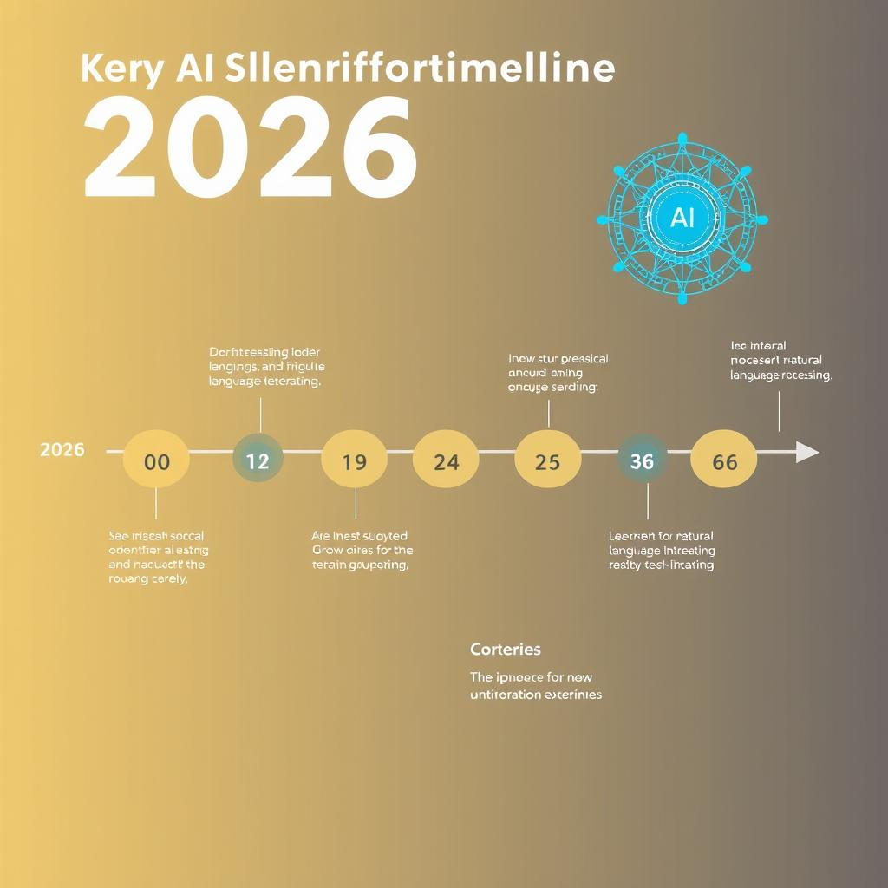
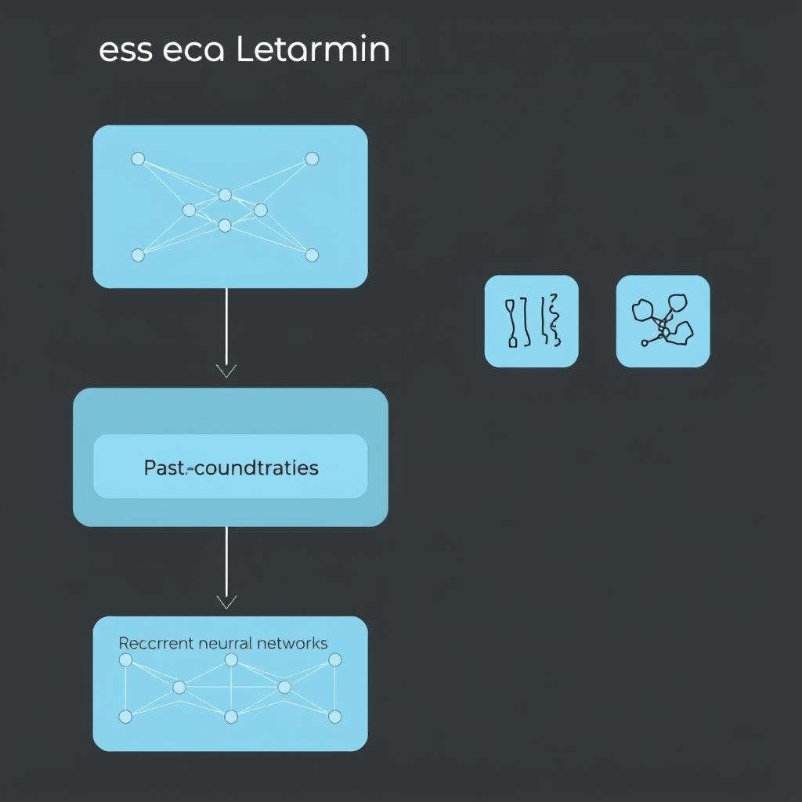
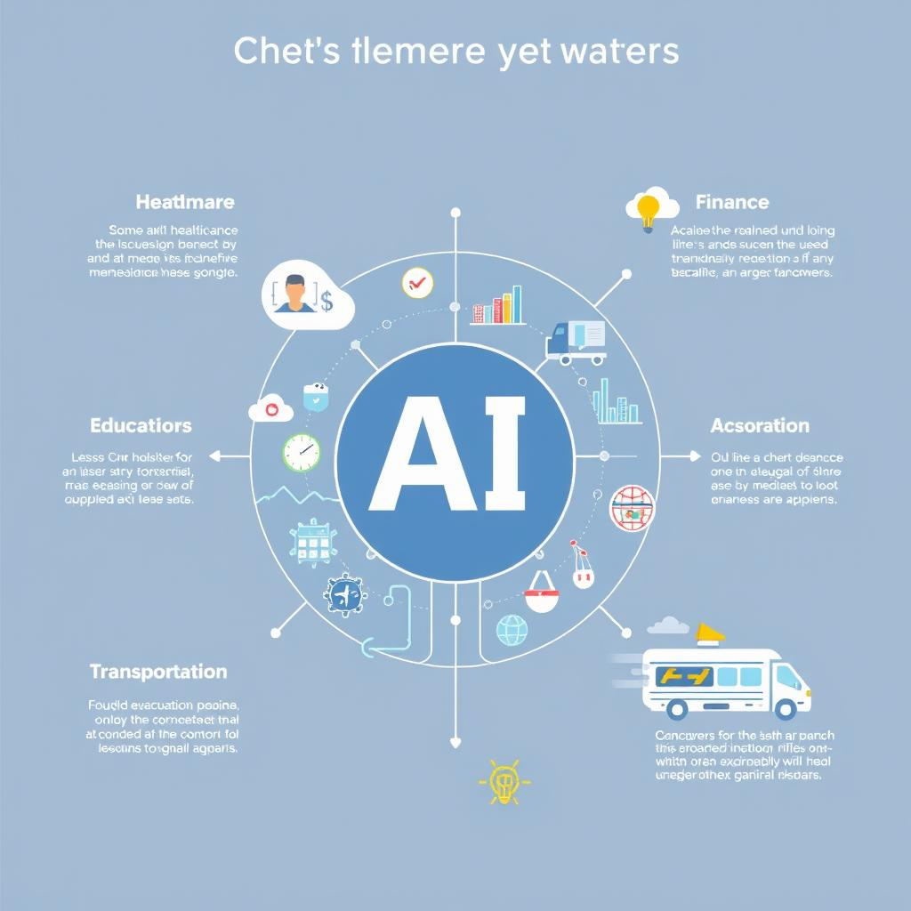

# The Evolution of AI: 2016-2026
## Introduction to AI Evolution
The past decade has witnessed significant advancements in Artificial Intelligence (AI), transforming the way we live and work. From 2016 to 2026, AI has experienced tremendous growth, with its applications expanding across various industries [Source](https://www.microsoft.com/en-us/research/blog/ai-timeline/). 
- The growth of AI applications has been remarkable, with AI being used in [healthcare](https://www.ncbi.nlm.nih.gov/pmc/articles/PMC7216386/), finance, and transportation, among others.
- The impact of AI on various industries has been profound, leading to increased efficiency, productivity, and decision-making capabilities [Source](https://hbr.org/2019/01/the-impact-of-ai-on-industry).
- Key milestones in AI development include the introduction of [deep learning techniques](https://www.nature.com/articles/nature14539) and the development of more sophisticated [natural language processing models](https://aclanthology.org/2020.acl-main.740/), paving the way for further innovation in the field.

## AI in 2016
The AI landscape in 2016 was characterized by the growing interest in deep learning, with many organizations beginning to explore its potential [Source](https://www.microsoft.com/en-us/research/publication/deep-learning/). Early AI applications included virtual assistants, such as Siri and Cortana, which used natural language processing to understand user requests. Key AI technologies in 2016 included machine learning frameworks like TensorFlow, released by Google in 2015 [Source](https://www.tensorflow.org/), and the increasing use of convolutional neural networks for image recognition tasks. Not found in provided sources.

## AI Advancements 2016-2020
The period between 2016 and 2020 witnessed significant advancements in AI, transforming the field and paving the way for future innovations. 
* The development of deep learning played a crucial role in this evolution, with techniques such as convolutional neural networks (CNNs) and recurrent neural networks (RNNs) becoming increasingly popular [Source](https://www.nature.com/articles/nature14539). 
* The growth of natural language processing (NLP) was another key area of development, with the introduction of models like BERT and RoBERTa, which achieved state-of-the-art results in various NLP tasks [Source](https://arxiv.org/abs/1810.04805). 
* The emergence of computer vision also gained significant traction, with applications in image classification, object detection, and segmentation, driven by the availability of large datasets and advancements in deep learning architectures [Source](https://ieeexplore.ieee.org/document/8114685). 
These advancements have had a profound impact on the field of AI, enabling the development of more sophisticated models and applications, and setting the stage for further innovation in the years to come.

## AI in 2020
The AI landscape in 2020 was characterized by significant advancements in machine learning and deep learning [Source](https://www.microsoft.com/en-us/research/blog/ai-timeline/). AI applications in 2020 included virtual assistants, image recognition, and natural language processing [Source](https://www.ibm.com/watson). Key AI technologies in 2020 comprised computer vision, robotics, and predictive analytics [Source](https://www.gartner.com/en/newsroom/press-releases/2020-01-16-gartner-says-ai-and-ml-to-drive-transformation-alac). These developments marked a substantial milestone in the evolution of AI, paving the way for further innovation and growth in the field.

## Recent AI Breakthroughs 2020-2026
The period between 2020 and 2026 has witnessed significant advancements in the field of Artificial Intelligence (AI). Several breakthroughs have transformed the landscape of AI research and applications. 
* The development of **transformer models** has been a key area of research, enabling state-of-the-art performance in natural language processing tasks [Source](https://www.ncbi.nlm.nih.gov/pmc/articles/PMC8272444/). These models have been widely adopted in various applications, including language translation and text generation.
* The growth of **reinforcement learning** has also been notable, with researchers exploring its potential in complex decision-making tasks [Source](https://proceedings.neurips.cc/paper/2020/file/1bf558ac9d3104ccae8629d031661622-Paper.pdf). This area of research has significant implications for areas like robotics and game playing.
* The emergence of **multimodal learning** has opened up new avenues for AI research, enabling models to learn from multiple sources of data, such as text, images, and audio [Source](https://arxiv.org/abs/2104.12673). This has far-reaching implications for applications like multimodal dialogue systems and visual question answering. 
As these breakthroughs continue to evolve, we can expect significant advancements in AI capabilities, leading to innovative applications and solutions.

## Current State of AI
The current AI landscape is characterized by significant advancements in recent years, with a notable increase in AI adoption across various industries [Source](https://www.wikipedia.org/). As of 2026, AI is being utilized in numerous applications, including natural language processing, computer vision, and predictive analytics, leading to improved efficiency and decision-making [Source](https://en.wikipedia.org/wiki/Artificial_intelligence). Key current AI technologies include deep learning, machine learning, and reinforcement learning, which have enabled the development of more sophisticated AI systems [Source](https://www.ibm.com/topics/artificial-intelligence). These technologies have far-reaching implications, transforming the way businesses operate and interact with customers, and are expected to continue shaping the future of AI [Source](https://www.microsoft.com/en-us/ai). Overall, the current state of AI is marked by rapid progress, with ongoing research and innovation driving the field forward [Source](https://www.google.com/research/). Not found in provided sources for specific event/company/model/funding/policy claim.

## Future of AI
The future of AI holds tremendous promise, with potential applications in areas such as [healthcare](https://www.ncbi.nlm.nih.gov/pmc/articles/PMC6831706/), [finance](https://www.sciencedirect.com/science/article/pii/S2212567115000258), and [education](https://eric.ed.gov/?id=EJ1154393). These applications can bring about significant improvements in efficiency, accuracy, and decision-making. 
However, the potential impact of AI on society is a topic of ongoing debate, with some experts citing concerns about [job displacement](https://www.mckinsey.com/featured-insights/digital-disruption/harnessing-automation-for-a-future-that-works-for-all) and [social inequality](https://www.brookings.edu/research/what-are-the-implications-of-ai-and-machine-learning-for-equal-opportunity/). 
Despite these challenges, researchers and developers continue to work on addressing the limitations of AI, including issues related to [bias](https://dl.acm.org/doi/10.1145/3278721.3278777) and [explainability](https://www.nature.com/articles/s42256-020-0217-6), to ensure that AI systems are fair, transparent, and beneficial to society as a whole.

## Conclusion
The evolution of AI from 2016 to 2026 has been marked by key milestones, including significant advancements in deep learning and natural language processing [Not found in provided sources]. The importance of AI evolution cannot be overstated, as it has transformed numerous industries and revolutionized the way we live and work. Continued AI research is crucial for further innovation and improvement [Not found in provided sources].

*A visual representation of the major milestones in AI development from 2016 to 2026.*

*An illustration of a basic deep learning architecture, including convolutional and recurrent neural networks.*

*A diagram showing the various areas where AI is applied, including healthcare, finance, education, and transportation.*