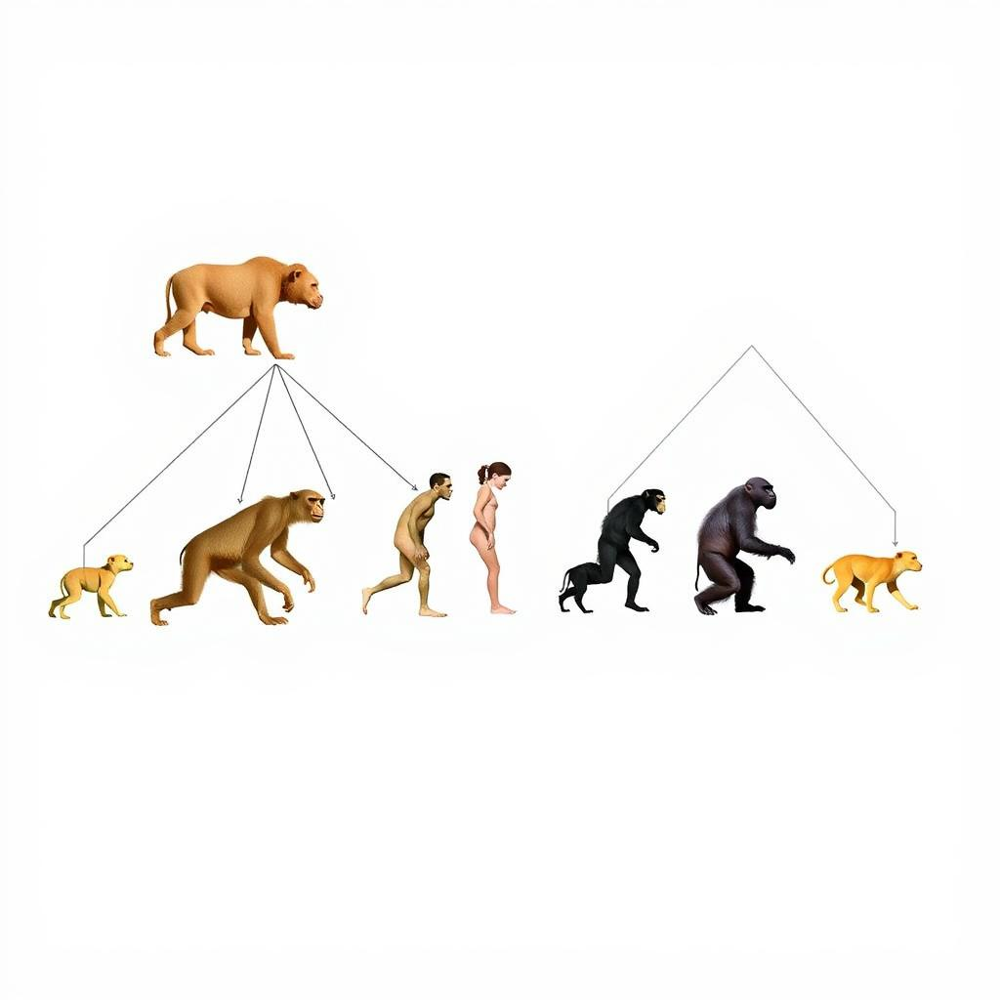
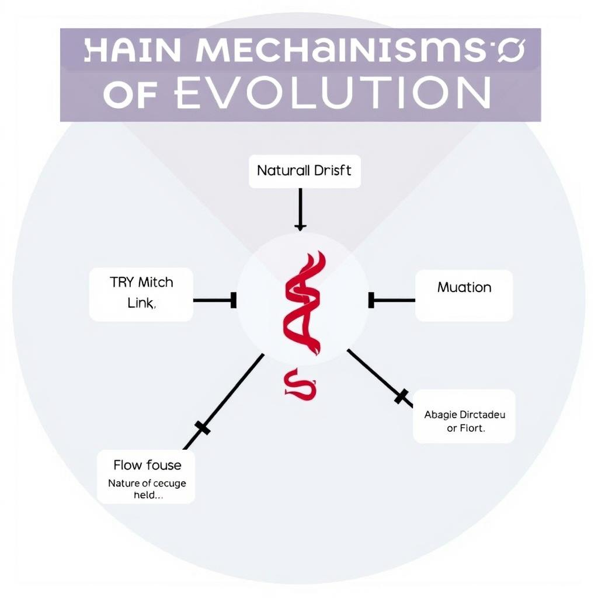

# The Evolution of Living Beings

## Introduction to Evolution
The concept of evolution is a fundamental aspect of biology, explaining how living beings have changed and diversified over time. To understand evolution, it's essential to start with its definition: evolution refers to the process through which species change and adapt to their environments, resulting in the diversity of life on Earth. 
The history of evolutionary theory dates back to ancient Greece, with philosophers such as Aristotle contributing to the discussion. However, it wasn't until the 19th century that the theory of evolution gained significant traction, particularly with the work of Charles Darwin. 
Key figures in evolutionary biology, including Darwin, Jean-Baptiste Lamarck, and Gregor Mendel, have played a crucial role in shaping our understanding of evolution, laying the groundwork for the complex and nuanced field we know today.

## Mechanisms of Evolution
The evolution of living beings is driven by several key mechanisms that shape the diversity of life on Earth. These mechanisms are essential to understanding how species adapt, change, and survive over time. The main mechanisms of evolution include:
* Natural selection: This process occurs when individuals with certain traits are more likely to survive and reproduce, passing those traits on to their offspring. Over time, this leads to the accumulation of adaptations that enable species to better fit their environments.
* Genetic drift: This mechanism involves random changes in the frequency of a gene or trait in a population, which can lead to the loss or fixation of certain characteristics. Genetic drift can occur due to various factors, such as genetic mutations or changes in population size.
* Mutation: Mutations are sudden, random changes in the DNA sequence of an individual, which can result in new traits or characteristics. These mutations can be beneficial, harmful, or neutral, and they provide the raw material for natural selection to act upon. By understanding these mechanisms, we can gain insight into the complex and dynamic process of evolution that has shaped the history of life on Earth.

## Evidence for Evolution
The theory of evolution is supported by a wide range of evidence from various fields of study. Some of the key evidence includes:
* Fossil record: The fossil record shows a clear pattern of gradual changes in life forms over time, with transitional fossils demonstrating the evolution of one species into another.
* Comparative anatomy: The study of comparative anatomy reveals similarities and homologies between different species, indicating a common ancestry.
* Molecular biology: Molecular biology provides evidence of evolution through the study of DNA and protein sequences, which show similarities and differences between species that are consistent with evolutionary relationships.
These lines of evidence all point to the same conclusion: that living beings have evolved over time through a process of variation, mutation, genetic drift, and natural selection. By examining the evidence from these different fields, we can gain a deeper understanding of the evolution of living beings and how it has shaped the diversity of life on Earth.

## Evolution of Species
The evolution of species is a fundamental concept in understanding how living beings change over time. Several key factors contribute to this process, including:
* Speciation, which refers to the formation of new species from existing ones, often resulting from geographical isolation or other mechanisms that prevent gene flow.
* Adaptation, where species develop traits that enhance their survival and reproductive success in response to environmental pressures.
* Co-evolution, which occurs when two or more species interact and influence each other's evolution, such as the relationship between predators and prey or hosts and parasites. 
These mechanisms have shaped the diversity of life on Earth, leading to the wide range of species we see today, from simple bacteria to complex organisms like humans.

## Human Evolution
The human species has undergone significant changes throughout its history, shaping who we are today. Considering **human origins**, research suggests that humans evolved from a common ancestor with other primates in Africa. The evolution of **human traits**, such as bipedalism and brain development, played a crucial role in the survival and adaptation of early humans. Furthermore, **human migration** out of Africa and into other parts of the world had a profound impact on the distribution and diversity of human populations. Understanding these aspects of human evolution provides valuable insights into the history and development of our species, highlighting the complex and dynamic process that has led to the diversity of human populations we see today.

*A diagram illustrating the relationships between different species and their evolutionary history*

*A timeline illustrating the major milestones in human evolution, from the emergence of early hominids to the present day*

*A diagram illustrating the main mechanisms of evolution, including natural selection, genetic drift, and mutation*