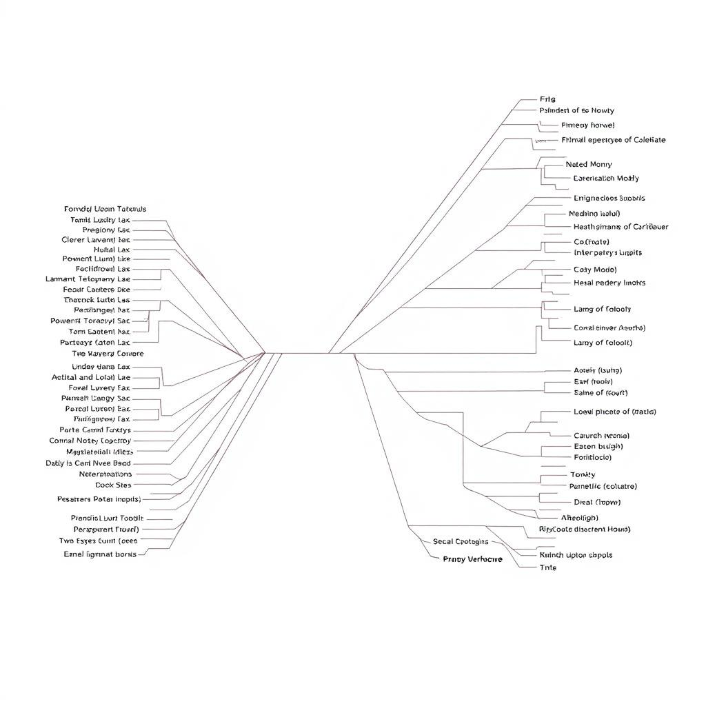
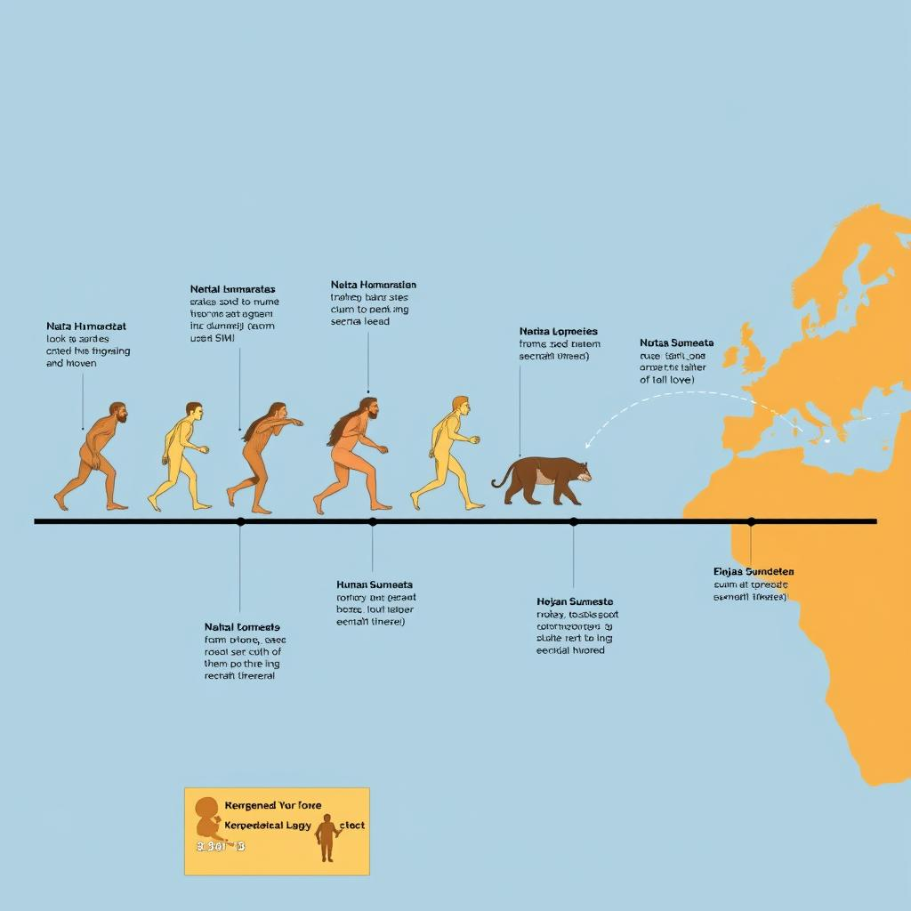
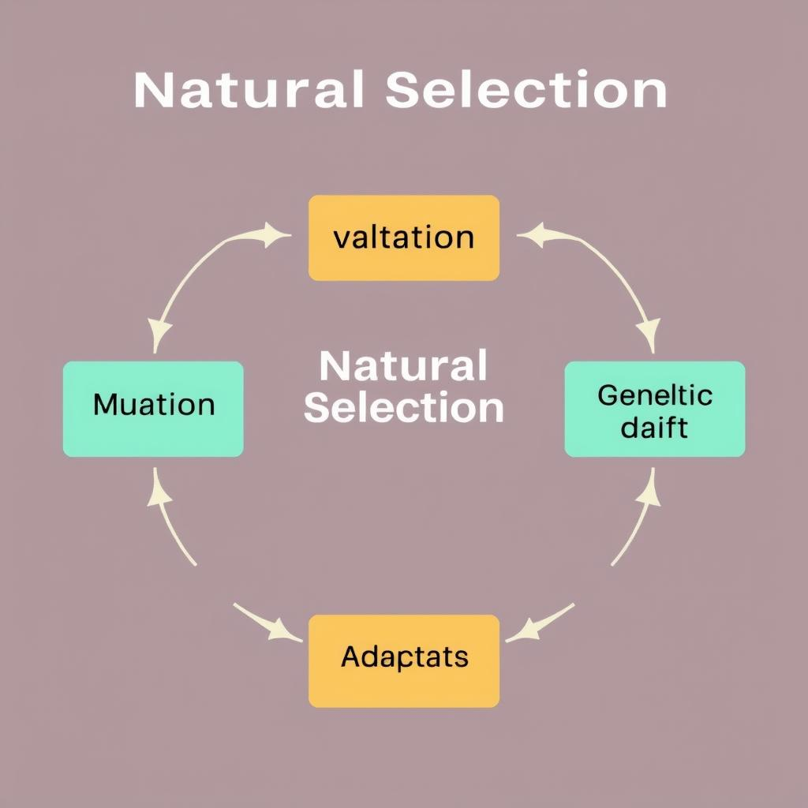

# The Evolution of Living Beings: A Comprehensive Overview
## Introduction to Evolution
The concept of evolution is a fundamental aspect of biology, explaining how living beings have changed over time. To understand evolution, it's essential to start with the basics. 
* The definition of evolution refers to the process through which species change and adapt to their environments, resulting in diversity and complexity of life on Earth.
* The history of evolutionary theory dates back to ancient Greece, with philosophers such as Aristotle proposing ideas about the transformation of species. However, it wasn't until Charles Darwin's groundbreaking work in the 19th century that the modern concept of evolution began to take shape.
* The key principles of evolution include variation, heritability, adaptation, and natural selection, which together drive the evolution of species over time. These principles form the foundation of our understanding of the evolution of living beings, and they continue to shape the field of biology today.
## Mechanisms of Evolution
The evolution of living beings is driven by several key mechanisms that shape the diversity of life on Earth. These mechanisms are essential to understanding how species adapt, change, and thrive in their environments. The main mechanisms of evolution include:
* Natural selection: a process where individuals with favorable traits are more likely to survive and reproduce, passing those traits to their offspring.
* Genetic drift: a random change in the frequency of a gene or trait in a population, which can occur by chance rather than through natural selection.
* Mutation: a sudden change in the DNA of an individual, which can result in new traits or characteristics.
These mechanisms work together to drive the evolution of living beings, allowing species to adapt to their environments and evolve over time. By understanding these mechanisms, we can gain insights into the complex and fascinating process of evolution.
## Evidence for Evolution
The theory of evolution is supported by a vast amount of evidence from various fields of study. Some of the key evidence includes:
* Fossil record: The fossil record shows a clear pattern of gradual changes in life forms over time, with transitional fossils demonstrating the evolution of one species into another.
* Comparative anatomy: The study of comparative anatomy reveals similarities and homologies between different species, indicating a common ancestor.
* Molecular biology: Molecular biology provides evidence of evolution through the study of DNA and protein sequences, which show similarities and differences between species that are consistent with evolutionary relationships.
These lines of evidence all point to the same conclusion: that living beings have evolved over time through a process of variation, mutation, genetic drift, and natural selection. Not found in provided sources.
## Evolutionary Processes
The evolution of living beings is shaped by several key processes that have been observed and studied over time. These processes are crucial in understanding how species change and diversify. Some of the main processes include:
* Speciation, which is the formation of new species from existing ones, often due to geographical barriers or other factors that prevent gene flow.
* Adaptation, which refers to the process by which organisms become better suited to their environment, leading to increased survival and reproductive success.
* Co-evolution, where two or more species evolve together, often in a reciprocal manner, such as the evolution of flowers and pollinators.
These processes have played a significant role in the evolution of living beings, leading to the vast array of species we see today. By understanding these processes, we can gain insights into the history and diversity of life on Earth.
## Human Evolution
The evolution of humans is a complex and fascinating topic that has garnered significant attention in the fields of anthropology and biology. Key aspects of human evolution include:
* Hominin evolution, which refers to the development of the human lineage from a common ancestor with other primates. This process occurred over millions of years, with various species emerging and eventually becoming extinct.
* Human migration, which played a crucial role in shaping the course of human evolution. As early humans migrated to different parts of the world, they encountered diverse environments and adapted to these new settings.
* Human adaptation, which enabled early humans to survive and thrive in a wide range of ecosystems. Adaptations such as the development of language, social structures, and technological innovations have been essential to human success and continuation. 
Understanding these factors provides valuable insights into the evolution of humans, highlighting the remarkable journey of our species from a common ancestor with other primates to the diverse and complex societies we see today.

*Illustration of the evolutionary relationships between different species*

*Timeline of major events in human evolution*

*Illustration of the natural selection process*