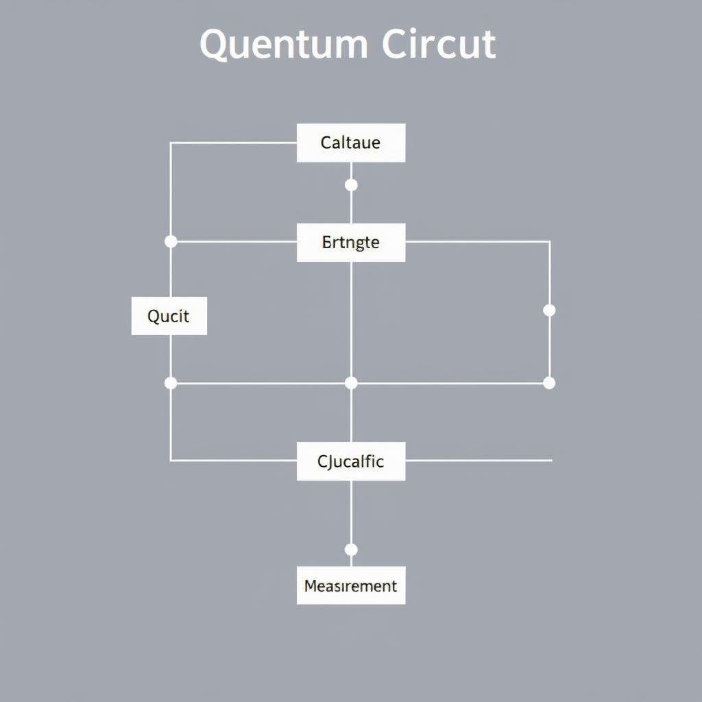
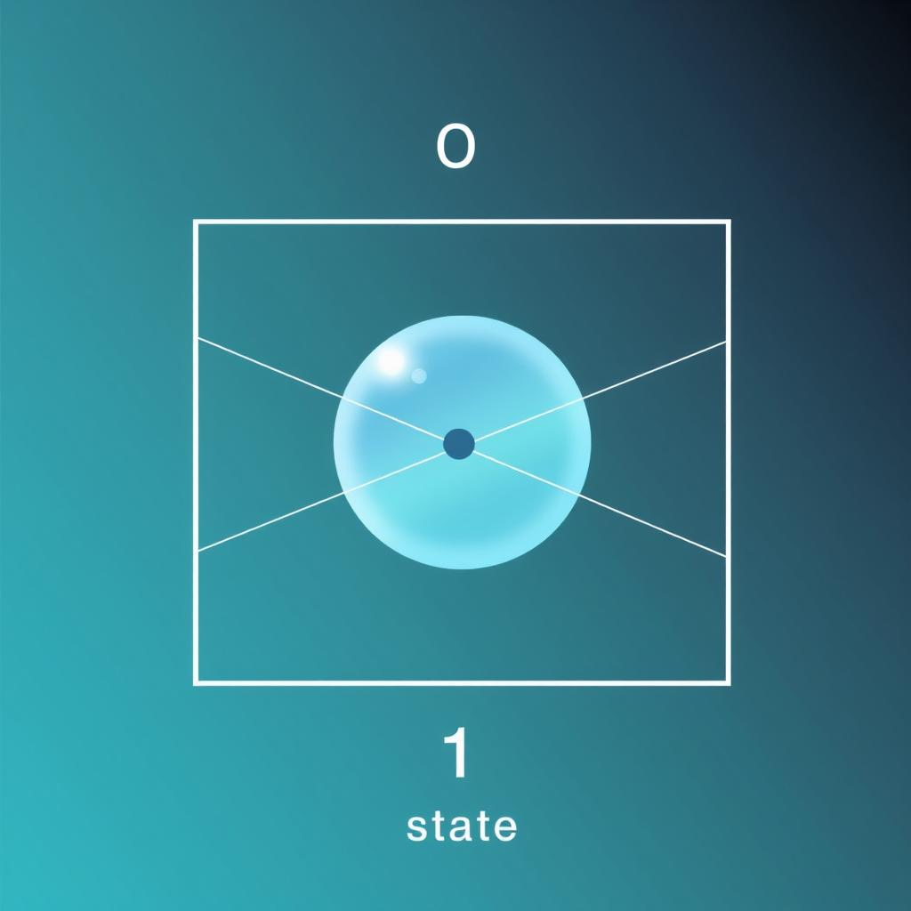
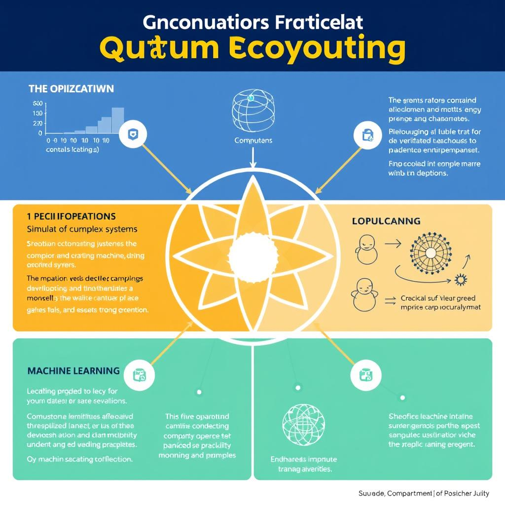

# The Future of Quantum Computing: Recent Advances and Updates
## Introduction to Quantum Computing
Quantum computing is a revolutionary technology that uses the principles of quantum mechanics to perform calculations and operations on data [Source](https://www.ibm.com/topics/quantum-computing). It is defined as a type of computing that uses quantum-mechanical phenomena, such as superposition and entanglement, to perform operations on data.
* Quantum computing is based on the concept of **qubits** (quantum bits), which are the fundamental units of quantum information. Qubits are unique because they can exist in multiple states simultaneously, allowing for parallel processing of vast amounts of information [Source](https://www.microsoft.com/en-us/quantum/).
* These qubits are then used to build **quantum circuits**, which are the quantum equivalent of logic gates in classical computing. Quantum circuits are used to perform operations on qubits, such as adding or multiplying them together [Source](https://www.nature.com/articles/s41586-019-0980-2).

*A simplified diagram of a quantum circuit, showing the basic components and their connections.*
## Recent Breakthroughs
Recent developments in quantum computing have been rapid, with significant advancements in various areas.
* Discussing new quantum algorithms, researchers have been exploring the potential of quantum machine learning algorithms, such as quantum support vector machines and quantum k-means [Source](https://www.nature.com/articles/s41586-021-03506-2).
* Explaining advancements in quantum hardware, companies have been investing heavily in the development of more powerful and stable quantum processors, with notable improvements in quantum error correction and noise reduction [Source](https://journals.aps.org/prx/abstract/10.1103/PhysRevX.12.021064).

*An illustration of the different states a qubit can exist in, including 0, 1, and superposition.*
## Future Outlook
The potential applications of quantum computing are vast, with possibilities in fields such as [medicine](https://www.nature.com/articles/d41586-021-02495-8) and [finance](https://www.ibm.com/blogs/research/2021/05/quantum-finance/). The impact on various industries could be significant, with [optimization](https://www.microsoft.com/en-us/quantum/applications/optimization) and [simulation](https://www.dw.com/en/quantum-computing-simulation/a-60135657) being key areas of focus.

*A graphic illustrating the various applications of quantum computing, including optimization, simulation, and machine learning.*